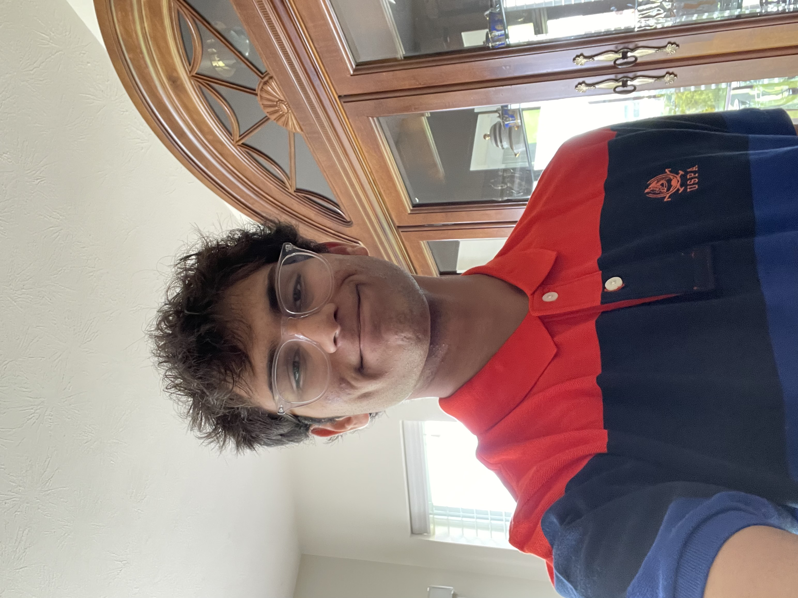

```{r setup, include=FALSE}
knitr::opts_chunk$set(echo = FALSE)
```

## Who Are We?
The [Walnut Hills Programming Club](https://github.com/WalnutProgramming), a chapter of [INTERalliance](https://www.interalliance.org/) meets on Tuesday's from 3-4pm in room 3104 to create projects and teach technical skills to students.

  Our club is a way for students to get hands-on programming, organizational, and leadership experience. Students collaborate to write code and create designs for games, websites, and more. Members create and run club events and attend INTERalliance chapter events as well as participate in [programming competitions](events.html).

## Why Join?
We want to get as many Walnut students, grades 7-12, into tech as possible. *No prior coding or design experience is necessary*.

  From complete beginners to more experienced artists and programmers, all club members participate on teams based on their level of experience and area of interest. In addition, Programming Club works to share excitement with the greater Walnut community through workshops and other projects. Our projects like [Walnut.Direct](walnut.direct) aim to positively impact the Walnut community.

## Our School
[Walnut Hills High School](https://walnuthillseagles.com/) is a college preparatory school for students in grades 7-12 in Cincinnati, Ohio. In addition to Programming Club, Walnut offers [computer science and design courses](http://www.walnuthillseagles.com/pdfs/2022-2023_Course_Guide.pdf), all of which are great resources for Walnut students who are interested in these fields. 

## Meet our 2022-23 Leadership Team!

### President: Annie Laursen
```{r annie, out.width = "50%"}
knitr::include_graphics("images/annie.jpg")
```
[Annie Lausen](mailto:alaursen@cincinnatips.org) is a junior at WHHS and this will be her third year as a member of Programming Club! When she's not coding, she enjoys running and singing in choir.

### Vice President: Marie Flessa
```{r marie, out.width = "50%"}

```
[Marie Flessa]() is a junior at WHHS and this is her second year in Programming Club! Outside of the computer lab, she enjoys baking, running, and playing lacrosse.

### Competition Code Director: Tejas Mundhe
```{r tejas, out.width = "50%"}
knitr::include_graphics("images/tejas.jpg")
```
[Tejas Mundhe](https://github.com/TejasMundhe) is a sophomore at Walnut Hills High School who has been a part of the programming club for the last three years. Outside of school he enjoys robotics, reading, and spending time with friends and family.

### Co-Competiton Code Director: Aditya Singh
```{r aditya, out.width = "50%"}

```
[Aditya Singh]() is in his Sophomore year at Walnut Hills High School. Outside of school he does Martial Arts, reads a lot, and plays video games.

### Treasurer: Raghav Gangatirkar
```{r raghav, out.width = "50%", out.extra='angle=270'}

```
[Raghav Gangatirkar](mailto:raghav.gangatirkar@gmail.com) is a junior at Walnut Hills High School and this will be his second year in programming club. He also rows for CJRC. Outside of school, he likes to read and fly his drone.

### Design Director: Arnav Shukla
```{r arnav, out.width = "50%"}

```
[Arnav Shukla]() is a junior at Walnut and this is his first year in Programming Club. He loves running, playing the tabla, and cooking!
