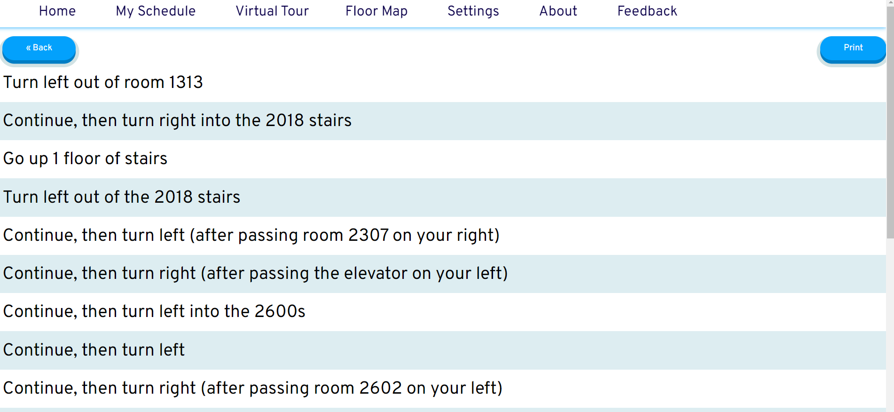
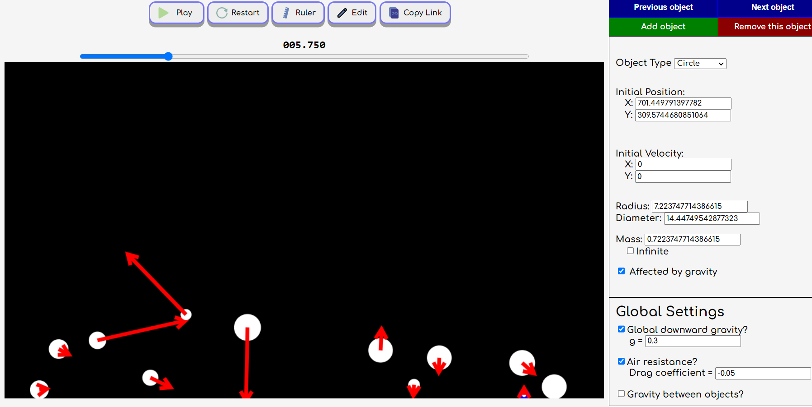
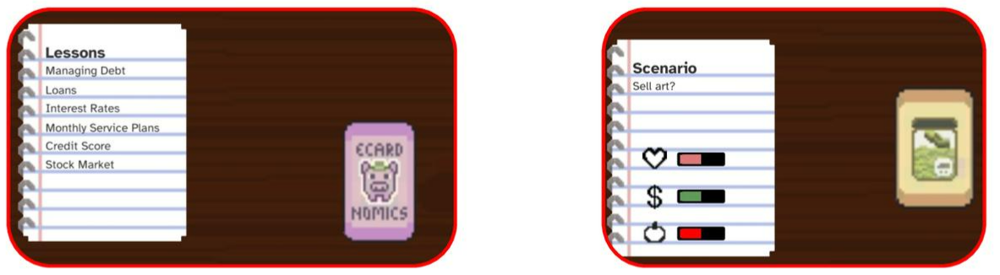

```{r setup, include=FALSE}
knitr::opts_chunk$set(echo = FALSE)
```

## Walnut.Direct
```{r walnut_direct}

```

[Walnut.Direct](https://www.walnut.direct/), our 2020 showcase project, gives students straightforward directions between rooms in our large, confusing school. It uses [room-finder](https://github.com/WalnutProgramming/room-finder), a library we created for using Dijkstra's algorithm, to generate directions between rooms in a building.


## No Lab Physics
```{r no-lab-physics}

```

Our 2021 showcase project, [No Lab Physics](https://no-lab-physics.netlify.app/), allows students and teachers to create their own custom physics labs.


## E-Card-Nomics
```{r financial-literacy-app}

```
[E-Card-Nomics](), our 2022 showcase project, is a game made to teach students financial literacy skills in a more engaging and entertaining way than a textbook or class would.
